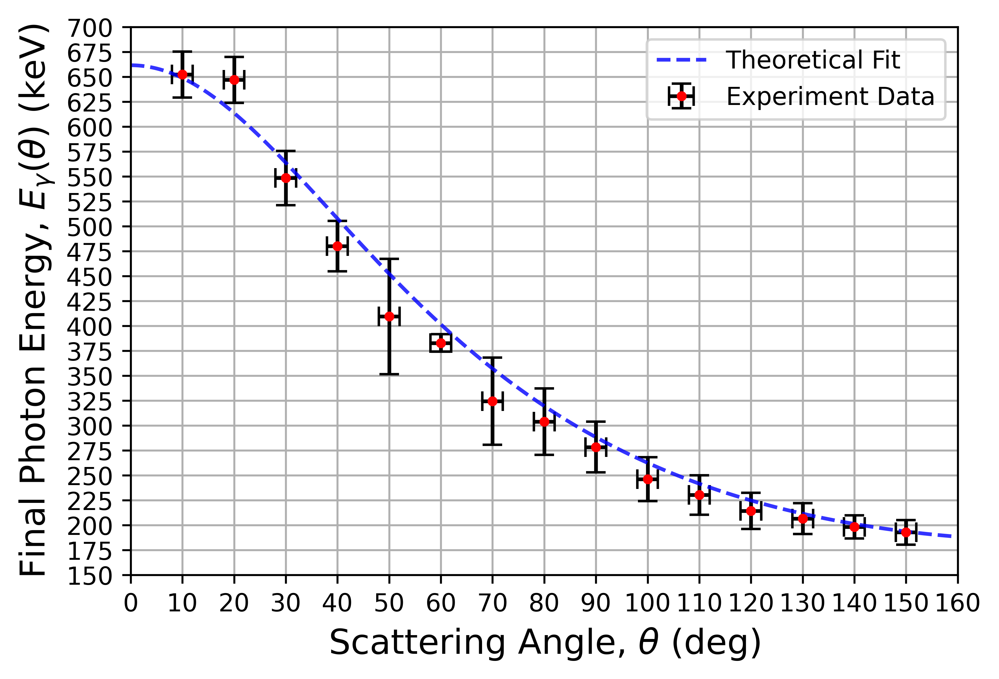
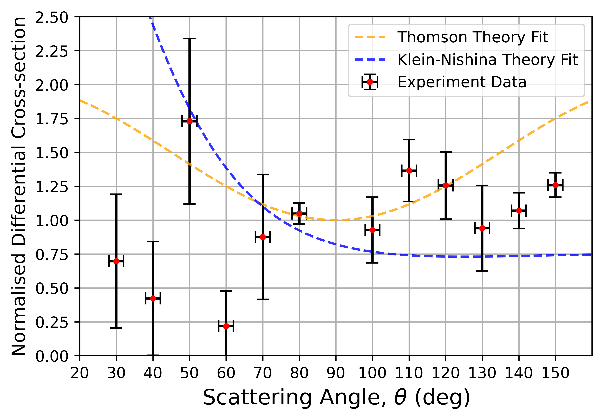
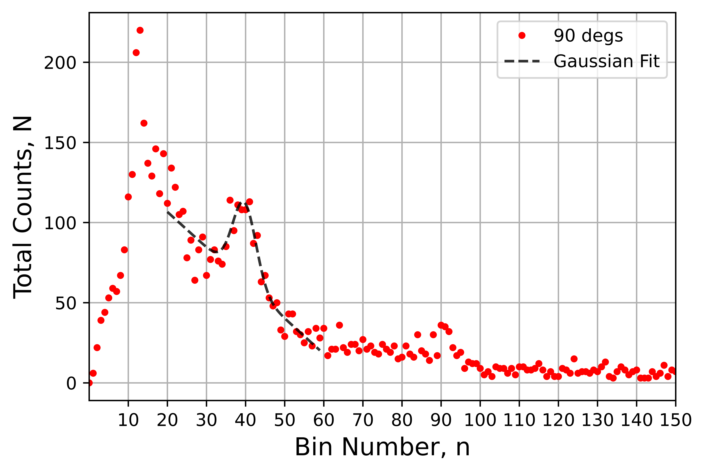

# Compton Scattering Data Analysis (Python)

## Project Overview
This project analyses experimental gamma-ray scattering data to verify the Compton effect and to compare classical and relativistic models of photon–electron scattering. Using Python-based statistical analysis and curve fitting, the experiment evaluates how well the **Thomson** and **Klein–Nishina** theories describe the measured differential cross-sections.

The analysis demonstrates how data processing, statistical modelling, and uncertainty analysis can be used to evaluate competing theoretical models.

---

---

## Objectives
- Extract photon peak positions from detector spectra
- Convert detector bin numbers to photon energy using calibration
- Calculate experimental differential scattering cross-sections
- Compare experimental results with theoretical predictions
- Evaluate model agreement using statistical methods

---

## Methods

### 1. Data Processing
- Raw photon count spectra were collected for multiple scattering angles.
- Background spectra were subtracted to isolate scattering signals.
- Spectral peaks were identified and analysed using Gaussian fitting.

### 2. Curve Fitting
Each spectral peak was fitted using a **Gaussian function with a linear background**:

This allowed the extraction of:
- Peak position (energy)
- Peak width
- Total counts under the Gaussian peak

The Gaussian area was used to estimate the photon counts for each scattering angle.

### 3. Statistical Analysis
The analysis includes:

- Non-linear regression
- Reduced chi-squared evaluation
- Error propagation
- Model comparison

### 4. Model Comparison
Experimental differential cross-sections were compared with predictions from:

- **Thomson Scattering** (classical model)
- **Klein–Nishina Scattering** (relativistic quantum model)

---

## Key Results

- The experimental data show some agreement with **Klein–Nishina predictions** at larger scattering angles (≈130–150°).
- Deviations for both models at smaller angles (≈30–60°) are likely caused by systematic experimental effects such as detector geometry and background subtraction.
- The results demonstrate the importance of relativistic corrections in photon–electron scattering.

---

## Example Output

The analysis produces plots comparing experimental measurements with theoretical models, such as:

- Photon spectra with Gaussian fits
- Energy calibration curves
- Scattered photon energy vs scattering angle
- Normalised differential cross-section vs scattering angle

These visualisations illustrate the verification of Compton scattering and how experimental data support the need for a relativistic scattering theory.

---

## Tools & Technologies

- **Python**
- **NumPy**
- **SciPy**
- **Matplotlib**

Key analysis techniques:
- Non-linear curve fitting
- Statistical model evaluation
- Scientific data visualisation

---

## Skills Demonstrated

This project demonstrates several data-analysis skills relevant to data science and analytics roles:

- Data cleaning and preprocessing
- Statistical modelling
- Curve fitting and regression analysis
- Uncertainty propagation
- Data visualisation
- Scientific model comparison

---

## How to Run the Analysis

1. Clone the repository:

https://github.com/Jack-Rice/compton-scattering-analysis.git

2. Run the analysis notebook or Python script.
